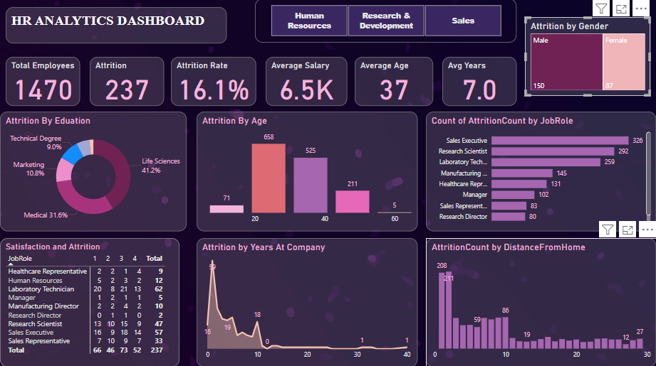

# hrDataAnalysis  
The **HR Analytics Dashboard** is a Power BI project designed to analyze employee attrition in a company. It provides key insights into workforce trends by tracking total employees, attrition rate, average salary, tenure, and age. The dashboard includes department-wise filters and various visualizations to explore factors influencing attrition, such as age, education, job role, satisfaction levels, and distance from home. This project helps HR teams identify patterns and make data-driven decisions to improve employee retention.

